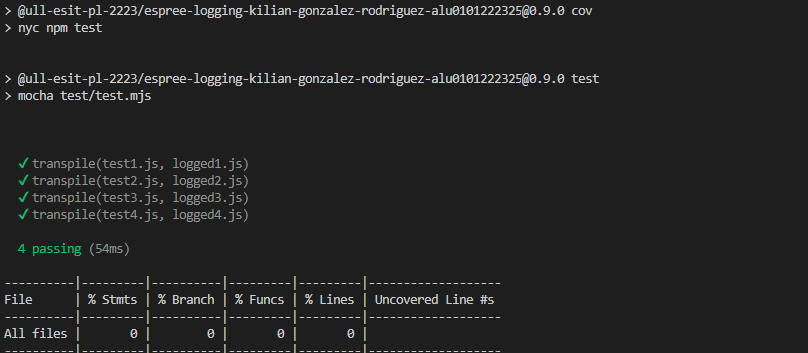
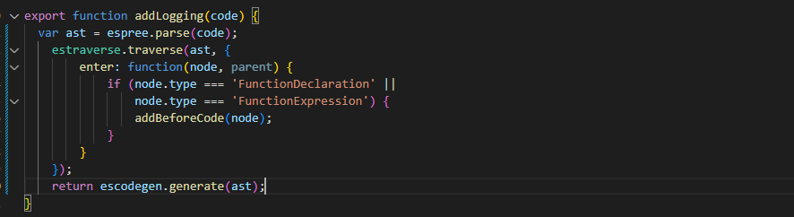
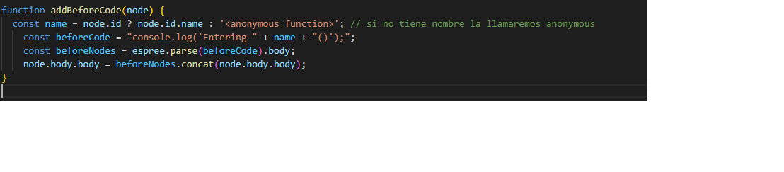
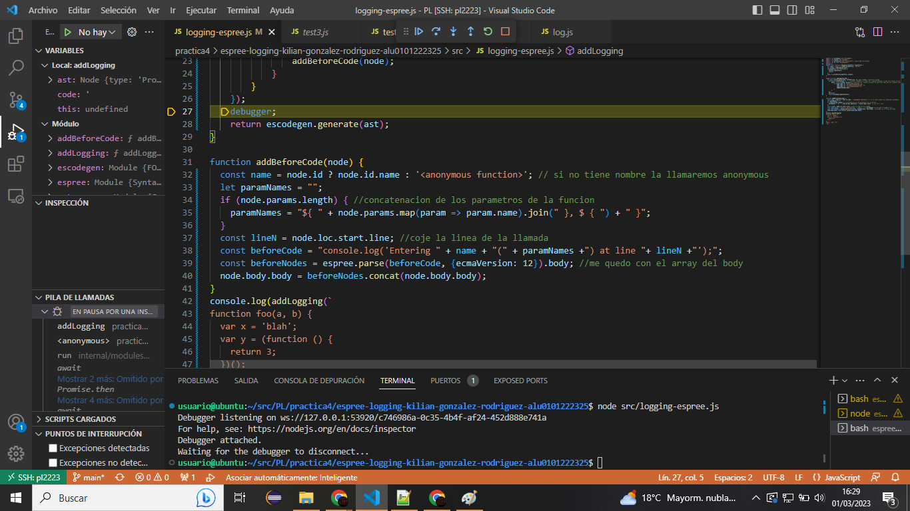
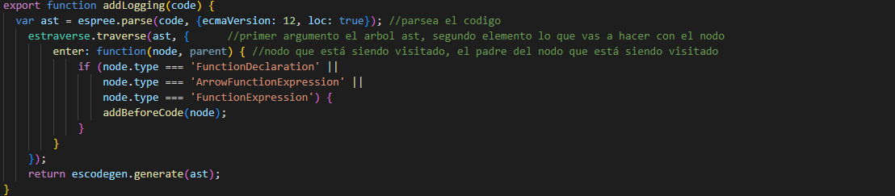
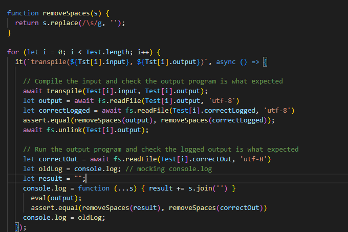
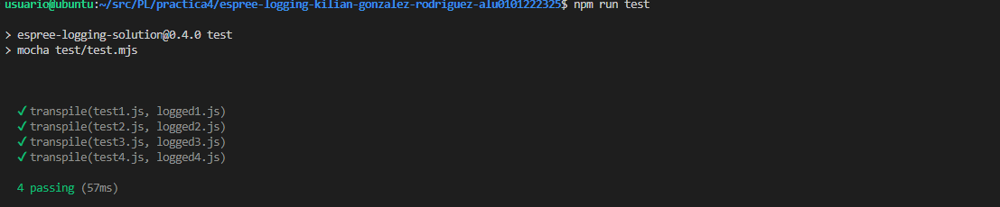
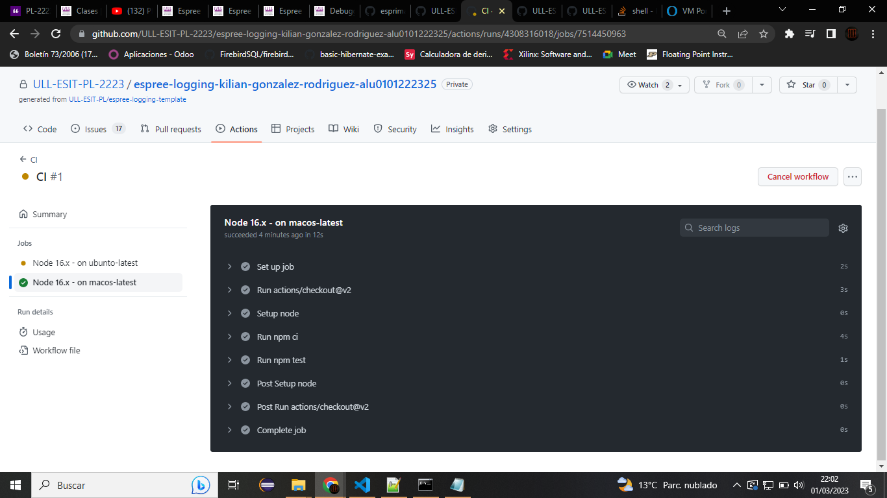
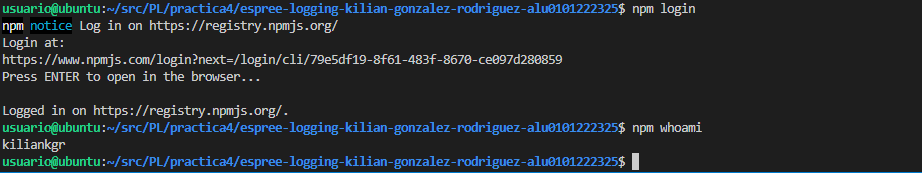
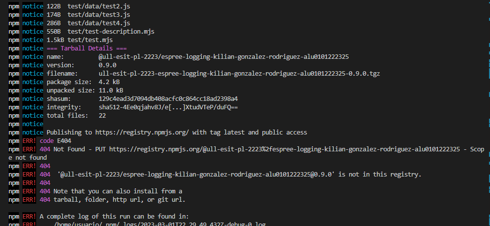

[](https://classroom.github.com/open-in-codespaces?assignment_repo_id=10328764)
# Práctica Espree logging

## Resumen de lo aprendido

* Uso de espree
* Uso de estraverse
* Publicacion como paquete npm

## Resultado del nyc


## Indicar los valores de los argumentos

Se ha modificado el código de `logging-espree.js` para que el log también indique los valores de los argumentos que se pasaron a la función. 
Ejemplo:

```javascript
function foo(a, b) {
  var x = 'blah';
  var y = (function (z) {
    return z+3;
  })(2);
}
foo(1, 'wut', 3);
```

```javascript
function foo(a, b) {
    console.log(`Entering foo(${ a }, ${ b })`);
    var x = 'blah';
    var y = function (z) {
        console.log(`Entering <anonymous function>(${ z })`);
        return z + 3;
    }(2);
}
foo(1, 'wut', 3);
```
### Pasos a seguir
Lo primero que haremos será aceptar la tarea, tras ello clonaremos el repositorio en nuestro workspace.
Ahora deberemos de instalar las dependencias mediante **npm ci**.
Rellenar la funcion addLogging

Rellenar la funcion addBeforeCode

Siguiendo los pasos de [debugging-chrome](https://ull-esit-gradoii-pl.github.io/temas/introduccion-a-javascript/debugging.html) , iniciamos el modo debugger para tratar de comprender que se está ejecutando.

Basicamente el programa se encarga de leer una codigo, parsearla para obtener el arbol AST, tras ello buscar las funciones para a posteriori añadirle salidas por pantalla con sus elementos.


## CLI con [Commander.js](https://www.npmjs.com/package/commander)

Aprevecharemos la platilla para la realizacion de las opciones las cuales no son necesarias modificar

## Reto 1: Soportar funciones flecha

La modificacmos para que coja la version deseada de spree y detecte la functionarrow


## Reto 2: Añadir el número de línea

En la funcion AddBeforeCode la modificamos para uqe muestre la linea


## Tests and Covering

Ahora tocan los test, para ello ya que ya tenemos los test solo necesitaremos una funcion que los llame y los parsee que se encuentra en nuestro fichero test.mjs

Ahora podemos ejecutar los test

Creamos una github action, para ello creamos el fichero .github/workflow/nodejs.yml 


## Publicación como paquete npm
Primero nos daremos de alta e introducimos los siquientes comandos en consola
**npm set init.author.name "Casiano Rodriguez-Leon"**
**npm set init.author.email "whatever@gmail.com"**
**npm set init.author.url "https://github.com/crguezl"**

Cambiamos en el package.json el nombre por el de nuestro repositorio y ejecutamos **npm publish --access=public**
Y nos da el siguiente error

